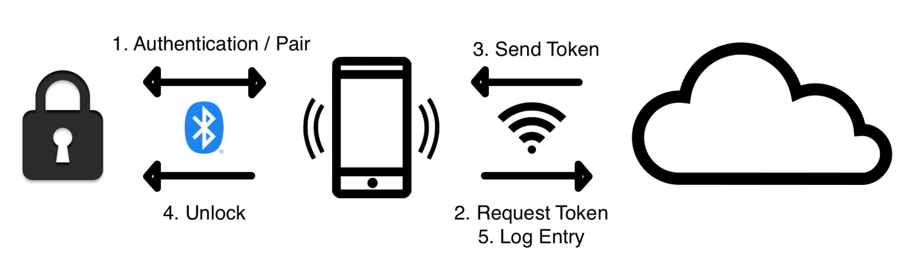

# Project Info

### The Service
The service is an SOA style application that consists of an API, Application, Domain, and Infrastructure (Repository) layers. This allows each layer to be loosely coupled for easy interchangability and development. Everything is built with testing in mind; this means heavy use of interfaces.

The service is deployed to: https://claytestcase.azurewebsites.net/ 

You can view the swagger API docs here: https://claytestcase.azurewebsites.net/swagger/index.html

### Assumptions
- The front-end app / webapp (client) is using an authentication server for the user. The client is then authenticated using OpenId/OAuth for all transactions to this service.
- The lock uses public/private key cryptography and the client is able to pass the public key over to the service.
    - Note the service is not actually encrypting anything as this is just a demo.
- The lock is not calling the service itself. The client does all of the work here. See diagram below.

### Workflow
The main workflow of the client and application is as follows (this is under the assumption that the client is already authenticated):
1. The client (webapp or app) pairs with the lock via bluetooth (or wifi).
2. The client sends a request to the service.
3. The service processes the request and sends back a token for the client to store. This involves generating a token and encrypting it with the locks public key (encryption not implemented).
4. The phone unlocks the lock with the token. The token has an expiry date and the client will have to request a new token after this token expires.
5. Everytime the lock is unlocked the client will send a log entry to the service to log a successful entry.

### Logging
- All user token requests all logged into the database and users can get a list of logs that are associated with their locks or their user ID.
- Every API call is logged on the application server. This way stacktraces have the complete set of input data.

### C# and .NET 5
The service was created using C# and .NET 5.0. It incorporates a variety of industry best practises and thoughtful design patterns that allow for easy extendability and development.

Reasons for use:
- I am the most comfortable with C# and .NET for building web services.
- Both are widely used and being worked on by Microsoft.
- Lots of libraries and frameworks that allow for easy and quick development, testing, deployment, database and object mapping.
- Highly reliable.

### Docker, Github, and Azure
I've created a dockerfile and image and deployed it to Azure. This is an automatic process as soon as the user merges in code into the master branch.

Reasons for use:
- Highly reliable and industry standard.
- Integrates well with .NET applications.
- Github is free and provides a variety of tools for CI, testing, deployment, etc..
- I've never used Github actions, docker, or Azure before so it was a good learning opportunity.

### Postgres Database
I'm using a Postgres database that is deployed in an Azure container. The database server contains a database for the service and one for unit tests.

Reasons for use:
- Highly reliable, industry standard database.
- Easy integration with Azure.
- Wanted to learn more about Postgres as I don't have much experience with it.

### IdentityServer4
I used IS4 for my OAuth/OpenID provider. I've not implemented any user authentication because in my opinion that should be done by a separate service that would authenticate the client. This service operates on the assumption that the client is authenticated. There are two scopes: Admin and User. Both are allowed certain API endpoints and Authorization happens on each endpoint.

Reasons for use:
- Industry standard and best practise.
- Relatively easy implementation and is easily extended for more scopes/clients.
- I've never used OAuth or OpenID before and this was a good opportunity to learn.

### Dapper for ORM
Rather than using Entity Framework I opted for a simple ORM simply because this is a relatively small service that needs to be as quick as possible. Adding EF adds a lot of overhead that might cause delays in issuing reponses.

### Other
- I used Nunit, Moq, and FluentAssertions for unit testing as these are what I'm used to and are relatively standard in the industry.
- NpgSql for the database connection due the use of Postgres.

### Ommisions
There were a few things that I would have liked to have added and/or finished but due to time constraints did not.
- Connection pooling configuration for NpgSql. I've left it at the default but it does allow for connecting pooling.
- Integration tests. I didn't add any integration tests, but this would have been the next logical step.
- Unfinished unit tests. I've completed some of the unit tests which should show how I go about writing them.
- A front end client and authentication service.
- Feature branches and merge functionality in the deployment github action. Currently as soon as you push to `master` the Action deploys straight to the Azure container. Ideally I'd have a feature branch and it would only deploy once merged.
- Github unit test status. I'd like the unit test and code coverage to show up on the github page.
